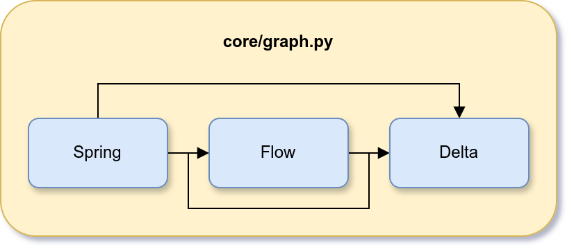
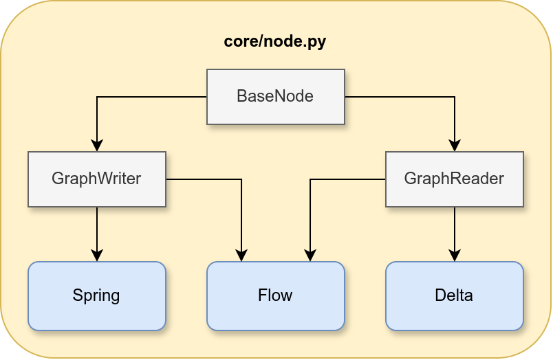

# Riveer 🚣

A simple query scheduler built on [Celery](https://docs.celeryq.dev/en/stable/) with transforms sending data to multiple
outputs.
Run many short and long tasks in parallel often and rarely.

### Design and Terminology

Riveer is designed to resemble a directed and acyclic graph. The **Graph** is the centerpiece, managing the transfer or
data and the triggering of Celery tasks.

The **Graph** is built from **Nodes** which can be one of three different types:

- **Spring**: Similar to a spring being the starting point of a river, this is a basic input into the **Graph**'s
  network. This **Node** has multiple periodic **Tasks** which can be configured to run
  using [cron-style](https://crontab.guru/) scheduling. The **Spring** is responsible for fetching data from a specific
  source and sending it into the **Graph** to multiple consumers.
- **Flow**: This is a **Node** which can transform and modify passed through **Data**. It can read from **Springs**
  or other **Flows**, allowing complex workflows, transformations and reusable **Nodes**. After processing, it can send
  the data either to other **Flows** or finally a **Delta**.
- **Delta**: Finally, similar to a river's delta, this **Node** marks the ends of the **Graph**. In this case, it
  handles the sending of processed data to external storages. This **Node** can only read from **Springs** directly or
  **Flows**, but not send to the **Graph**.

The following diagram visualizes the possible interconnections between each **Node** type:



The different types of **Nodes** are dynamically loaded on program startup,
and are located in the `src/extensions/<node>/` folder. 
See the [Developing](#developing) section for more information on this.

Each **Node** has at least one **Task**. This is the defined function that gets executed when triggering the **Node**.
This can either happen through a Cron schedule or by a finished **Task** that is sending **Data** to the next **Nodes**
in the **Graph**. For now **Springs** can have multiple, while **Flows** and **Deltas** are defined by only one
**Task**.

For simplicity, the `Data` that is being passed between Nodes (and Celery threads) must be JSON serializable.

On program start-up, each configuration file gets validated against each **Node**'s schema,
as well as ensuring the correct and acyclic connections of the **Graph**.

### Configuration

Riveer is configured using `YAML` files and environment variables. For simplicity, each **Node** is defined in its own
file, but can also be combined in one file using YAML's dash syntax. If no `name` field is provided, by default the
file's name without the filetype suffix. This can raise errors if you combine multiple configurations in one file
without providing individual names. The configuration files are located in the `config` folder, which can be
overwritten using the `RIVEER_CONFIG` environment variable.

Each configuration file has a *header* under the `configurations` key, which defines the name and type of the **Node**.
The rest of the file is the configuration for the **Node** itself. For **Springs** and **Deltas**, the configuration
usually has a `connection` field which is for connecting to outside instances. While **Springs** have a `tasks` field,
holding a list of configurations for **Tasks**, the other **Nodes** have a `processing` field, for configuring the
execution of their **Task**.

Some fields can load environment variables using the `${...}` syntax, which is especially useful for sharing
configurations while avoiding sharing secrets and separating sensitive information.
Check each **Node**'s `config_schema()` function for a detailed list of required and optional variables.
A basic example for transferring data snapshots from [PostgreSQL](https://www.postgresql.org/) to
[OpenSearch](https://opensearch.org/) can be found in `.examples/` folder.

### Running Locally

First, you should create a virtual environment of your choice with a python executable.
After that, install Riveer locally:

```shell
python3 -m pip install .
```

For Celery to work properly, you need to have a broker running. By default, Riveer uses a
local [RabbitMQ](https://www.rabbitmq.com/) instance, which can be overwritten using the `RIVEER_BROKER` environment
variable. Riveer is only being tested with RabbitMQ, but it is possible to use other brokers, compatible
with [Celery](https://docs.celeryq.dev/en/stable/getting-started/backends-and-brokers/index.html#broker-overview).
You can quickly start RabbitMQ with Docker with the following command:

```shell
docker run -it --rm --name riveer_broker -p 5672:5672 rabbitmq:latest
```

Then you can run the `Riveer` with the following command. Ensure to use a pool witch allows concurrent execution for
parallel running tasks:

```shell
python -m celery -A main worker --beat --pool=threads --loglevel=INFO
```

### Developing

The dynamic structure allows easy development of new **Nodes**.
The following diagram visualizes more closely the abstract structure of the **Nodes**:



To create a new **Node**, you need to create a new Python file in the `src/extensions/` folder.
Preferably select the folder with the corresponding type naming of the new **Node**, but it will not affect the loading
based on folder name.
In the new file, define a new class which inherits from either `Spring`, `Flow` or `Delta`.
Do not directly inherit from `GraphWriter` or `GraphReader`, as these classes are not intended for direct inheriting
and they will raise an error on module loading.
Define all required methods and properties, and ensure that the `config_schema()` is covering all required fields.
Restart the application to load the new modules.
